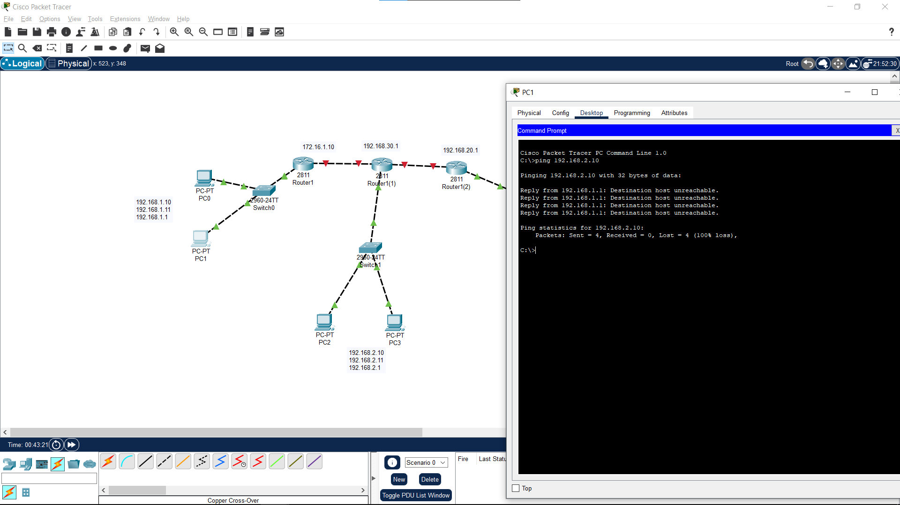
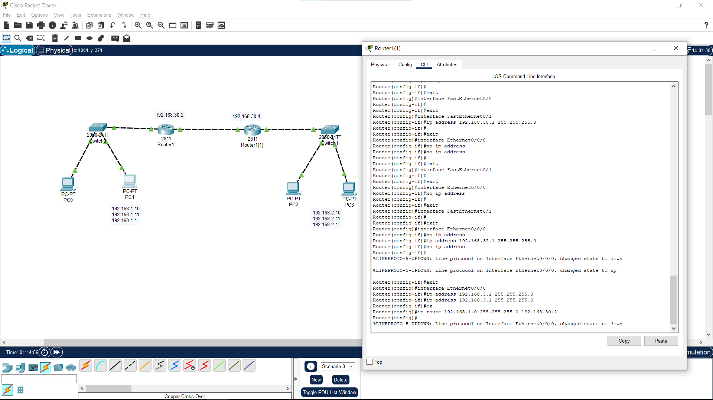
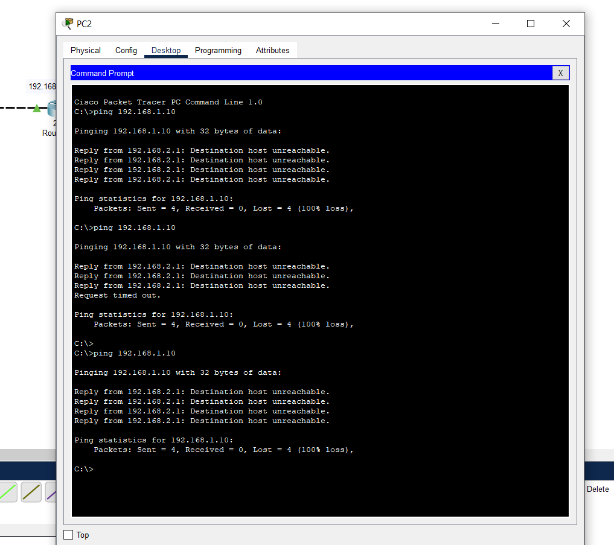
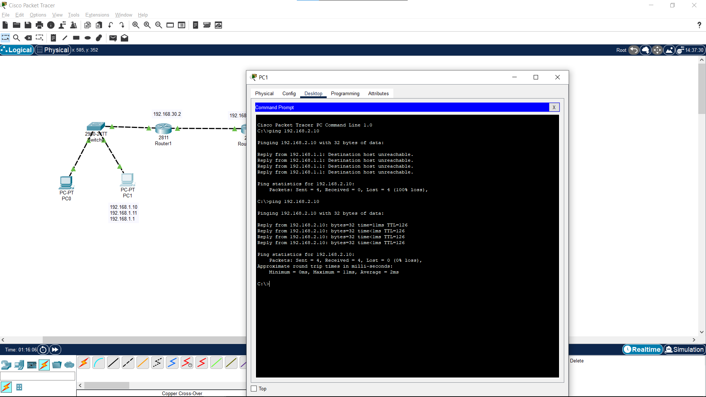

# cisco-static-routing-lab
Konfigurasi jaringan menggunakan Cisco Packet Tracer dengan dua router, dua LAN, dan static routing untuk komunikasi antar jaringan. Termasuk dokumentasi progress, hasil uji konektivitas, serta video proof.

# 🧩 Cisco Packet Tracer Networking Project

## 📸 Progress Documentation

Berikut dokumentasi perkembangan konfigurasi jaringan dari awal hingga tahap akhir pengujian.

  
   
  
  

---

## 🎥 Proof of Connectivity (Video)

    
  <video width="80%" controls>
    <source src="proof.mp4" type="video/mp4">
    Your browser does not support the video tag.
  </video>

*Video menunjukkan hasil pengujian konektivitas antar PC melalui perintah `ping`, memastikan konfigurasi berjalan sukses.*

---

## 🌐 Cisco Packet Tracer Topology

  

**Project File:** [`cisco.pkt`](Cisco/cisco.pkt)

---

## ⚙️ Network Configuration Overview

### 🖥️ Left Network
| Device | Interface | IP Address | Gateway |
|--------|------------|-------------|----------|
| PC0 | FastEthernet0 | 192.168.1.10 | 192.168.1.1 |
| PC1 | FastEthernet0 | 192.168.1.11 | 192.168.1.1 |
| Router1 | G0/0 | 192.168.30.2 | — |
| Router1 | G0/1 | 192.168.1.1 | — |

### 🖥️ Right Network
| Device | Interface | IP Address | Gateway |
|--------|------------|-------------|----------|
| PC2 | FastEthernet0 | 192.168.2.10 | 192.168.2.1 |
| PC3 | FastEthernet0 | 192.168.2.11 | 192.168.2.1 |
| Router1(1) | G0/0 | 192.168.30.1 | — |
| Router1(1) | G0/1 | 192.168.2.1 | — |

---

## 🔁 Connection Summary

- Dua LAN dihubungkan melalui dua router menggunakan jaringan antar-router `192.168.30.0/30`.
- Setiap PC memiliki **default gateway** ke router masing-masing.
- Router dikonfigurasi dengan **static routing** agar jaringan dapat saling berkomunikasi.

---

## ✅ Testing Summary

- Pengujian komunikasi antar PC berhasil menggunakan perintah `ping`.
- Komunikasi berhasil antara:
  - `PC0 ↔ PC2`
  - `PC1 ↔ PC3`
- Bukti dapat dilihat pada **gambar dan video proof** di atas.

---

## 📅 Activity Info

- **Tanggal:** November 4  
- **Lokasi File:** `Documents/PKL_ACTIVITY/November4/Cisco/`

---

📘 *Documentation created for Cisco Packet Tracer networking practice project.*
